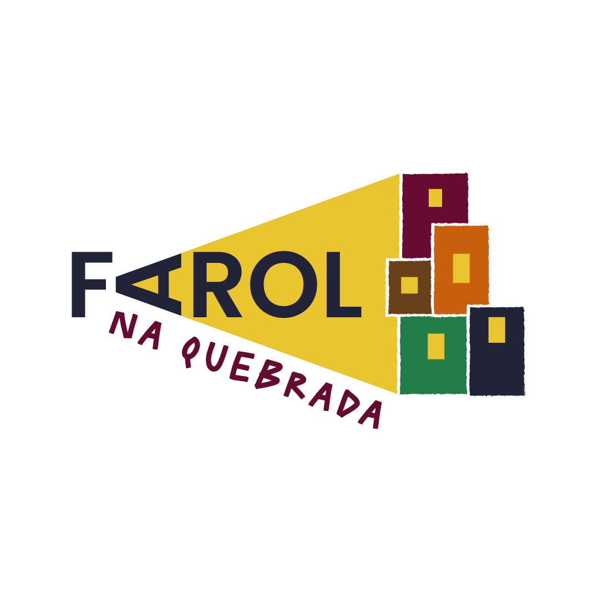

## Farol na quebrada 

### Aula extra de python 
Exploraremos um pouco mais o poder da [linguagem de programação mais utilizada no mundo atualmente](https://spectrum.ieee.org/top-programming-languages-2024).

#### Quem é o professor:

- 

#### Começando do começo
1. Instalar o [python](http://python.org)
2. Criar um repositório no [GitHub](https://github.com/)
3. Instalar uma IDE de desenvolvimento 

|Vs Code|PyCharm|
|:-:|:-:|
|||

4. Criar um diretório onde ficará os arquivos fonte do projeto
5. Clonar o repositório criado no GitHub dentro do diretório criado: 
    - `git clone https://github.com/<usuario_git>/<nome_repositorio>.git .`
6. Criar um [ambiente virtual python](https://docs.python.org/pt-br/3/library/venv.html) dentro do diretório.
    - `python -m venv ./env_farol`
7. Ativar o ambiente virtual criado:
    - `env_farol\Scripts\activate`
8. Instalar bibliotecas que serão utilizandas no projeto
    - `python -m pip install --upgrade pip`
    - `pip install <nome_biblioteca1> <nome_biblioteca2> ...`
9. Criar o arquivo `.gitignore` na raiz do diretório criado e adicionar:
    - `env_farol/`